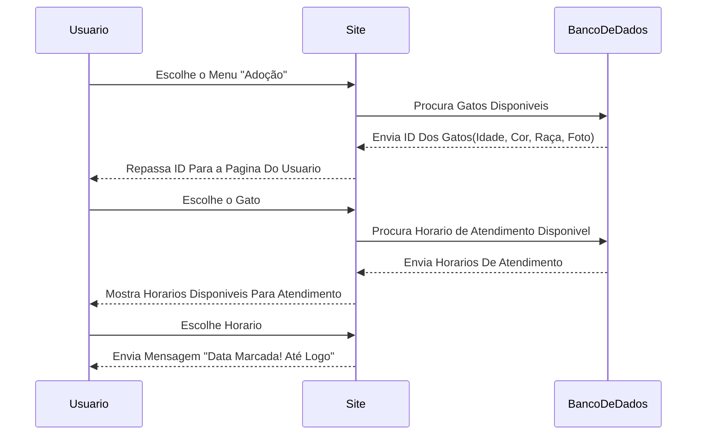
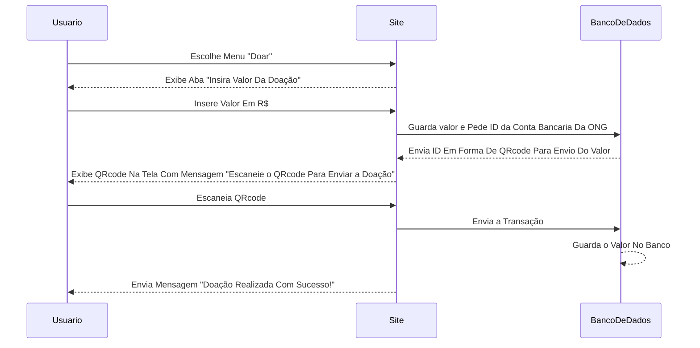
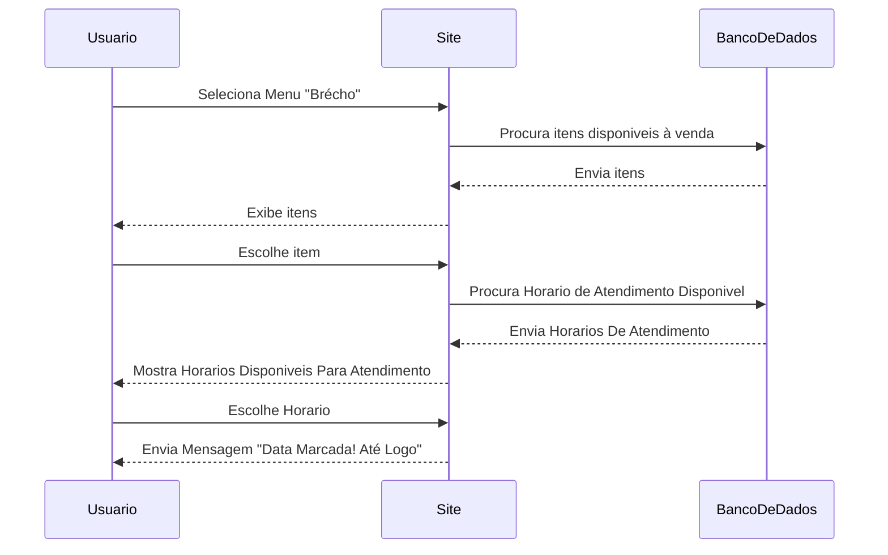
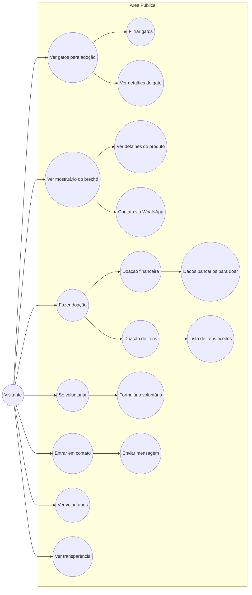
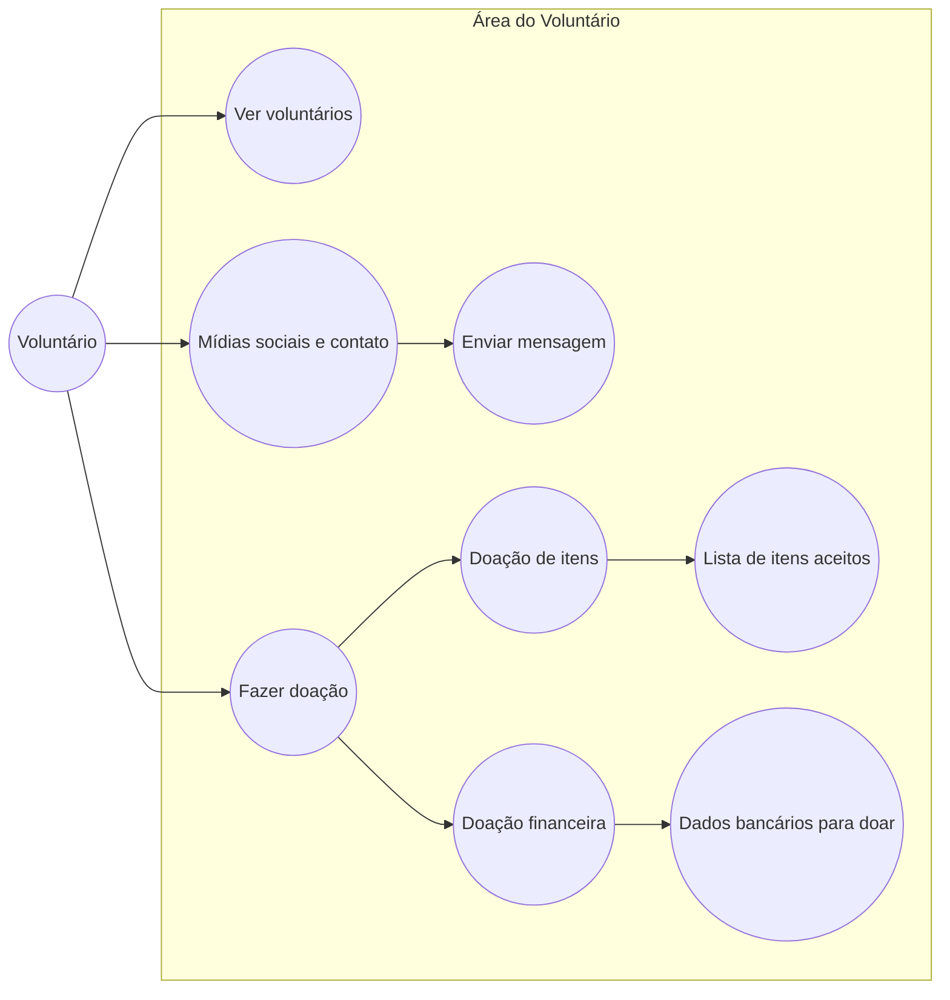
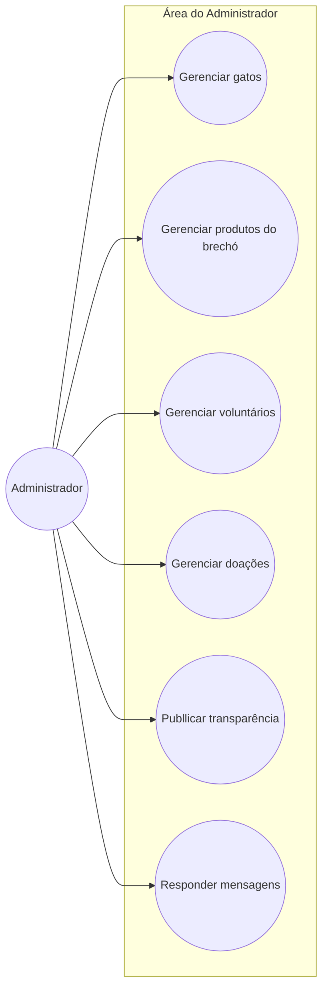
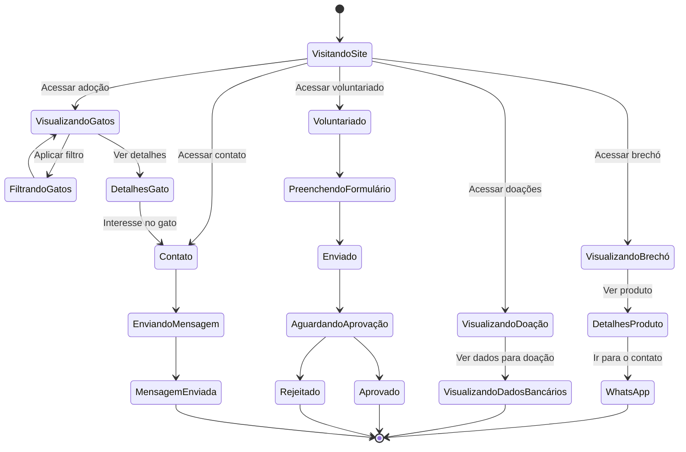
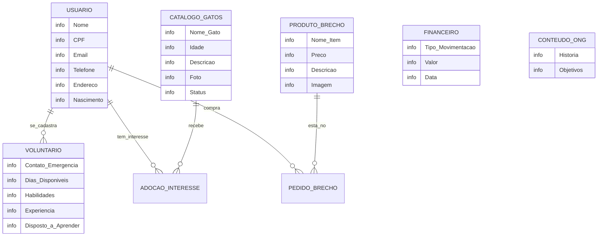
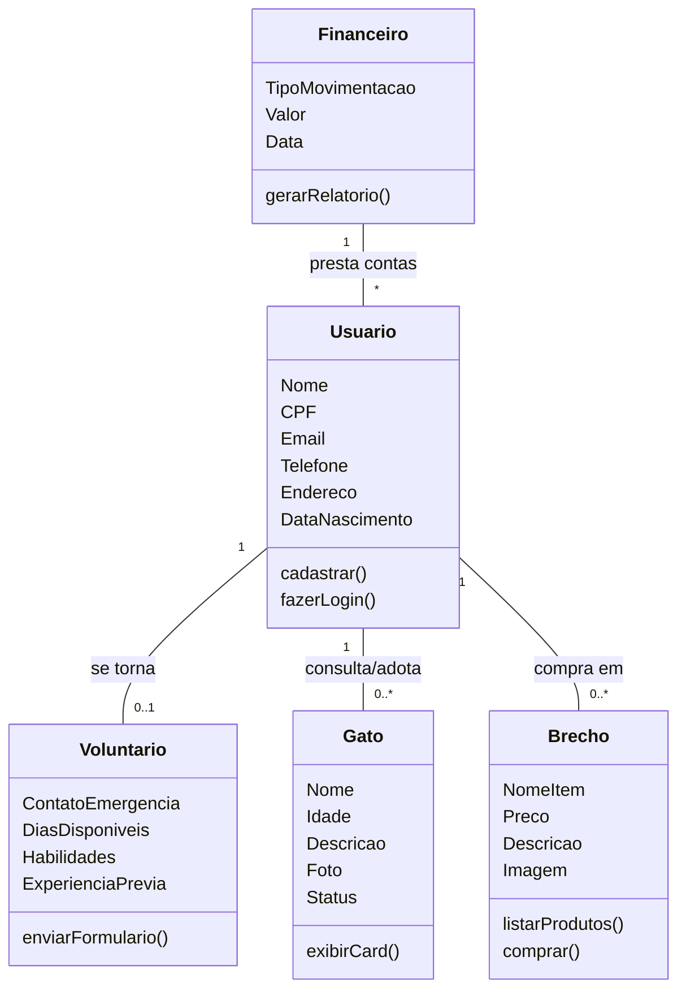

# 🐱 Casa dos Gatos - Projeto Web

## 📌 Sobre o Projeto

Este projeto foi desenvolvido por um grupo de 5 estudantes do curso de Análise e Desenvolvimento de Sistemas da FATEC Araraquara, com o objetivo de criar um site para a ONG **Casa dos Gatos**.

A ideia principal é ajudar a ONG a ter mais visibilidade, mostrando o trabalho que eles fazem no resgate, cuidado e adoção de gatos, além de facilitar a comunicação com voluntários e apoiadores.

---

## 🎯 Objetivo

Criar uma plataforma simples, organizada e acessível para:

* Divulgar o trabalho da ONG
* Aumentar o número de adoções
* Atrair voluntários
* Facilitar doações e apoio financeiro

---

## 🧩 Funcionalidades do Site

O site contará com as seguintes páginas:

* **Sobre Nós**
  Informações sobre a ONG, sua história e missão.

* **Voluntários**
  Apresentação das pessoas que já ajudam o projeto.

* **Voluntarie-se**
  Formulário para novos interessados participarem como voluntários.

* **Como Ajudar**
  Explicação de formas de contribuição (doações, serviços, etc).

* **Portal da Transparência**
  Informações financeiras e prestação de contas da ONG.

* **Gatos para Adoção** 🐾
  Lista de gatos disponíveis, com fotos e informações.

* **Brechó Online** 🛍️
  Venda de produtos para arrecadar fundos para a ONG.

  ---

## 🛠️ Tecnologias Utilizadas

*(Essa parte pode ser ajustada conforme o projeto evoluir)*

* HTML
* CSS
* JavaScript
* BootStrap
* MySql


---


## 👨‍💻 Equipe

Projeto desenvolvido por estudantes da FATEC Araraquara:

* Carlos Eduardo Fagian Filho
* João Pedro de Oliveira
* Ligia Cristina de Oliveira
* Manoela Zanin Zanardi
* Walisson Rodrigues Dos Santos

---

## 🚀 Status do Projeto

🟡 Em desenvolvimento

---

## 💡 Considerações Finais

Esse projeto foi pensado não só como atividade acadêmica, mas também como uma forma de contribuir com uma causa importante. Esperamos que o sistema ajude a ONG a alcançar mais pessoas e, principalmente, encontrar lares para muitos gatinhos ❤️🐱

---
## Diagramas de Sequencia
### 🐈 Adotar [(LinkRaw)](https://raw.githubusercontent.com/ligiaoliveira/Casa-dos-Gatos/refs/heads/main/docs/diagramas/sequencia_adocao.md)

### 💸 Doar [(LinkRaw)](https://raw.githubusercontent.com/ligiaoliveira/Casa-dos-Gatos/refs/heads/main/docs/diagramas/sequencia_doacao.md)

### 🛍 Brécho [(LinkRaw)](https://raw.githubusercontent.com/ligiaoliveira/Casa-dos-Gatos/refs/heads/main/docs/diagramas/sequencia_brecho.md)

## Diagramas de Caso de Uso

### 👤 Visitante [(LinkRaw)](https://raw.githubusercontent.com/ligiaoliveira/Casa-dos-Gatos/refs/heads/main/docs/diagramas/casos_visitante.md)

---

### 🙋 Voluntário [(LinkRaw)](https://raw.githubusercontent.com/ligiaoliveira/Casa-dos-Gatos/refs/heads/main/docs/diagramas/casos_voluntario.md)


---

### 🔐 Administrador [(LinkRaw)](https://github.com/ligiaoliveira/Casa-dos-Gatos/raw/refs/heads/main/docs/diagramas/casos_admin.md)


---

## Diagrama de Estados

### 👤 Visitante [(LinkRaw)](https://github.com/ligiaoliveira/Casa-dos-Gatos/raw/refs/heads/main/docs/diagramas/estados_visitante.md)


---

### 🙋 Voluntário [(LinkRaw)](https://www.google.com/search?q=https://raw.githubusercontent.com/ligiaoliveira/Casa-dos-Gatos/main/docs/diagramas/estados_voluntario.md)

```mermaid
stateDiagram-v2

  [*] --> AcessandoSite

  AcessandoSite --> VisualizandoInformações
  VisualizandoInformações --> VisualizandoVoluntários
  VisualizandoInformações --> EntrandoEmContato

  %% Contato
  EntrandoEmContato --> EnviandoMensagem
  EnviandoMensagem --> MensagemEnviada
  MensagemEnviada --> [*]

  %% Visualização
  VisualizandoVoluntários --> [*]
  ```
---

### 🔐 Administrador [(LinkRaw)](https://github.com/ligiaoliveira/Casa-dos-Gatos/raw/refs/heads/main/docs/diagramas/estados_admin.md)

```mermaid
stateDiagram-v2

  [*] --> Login
  Login --> PainelAdmin : Login válido
  Login --> [*] : login inválido

  %% HUB CENTRAL
  state PainelAdmin
  
  %% Distribuição equilibrada
  PainelAdmin --> GerenciandoGatos
  PainelAdmin --> GerenciandoProdutos
  PainelAdmin --> GerenciandoVoluntários
  PainelAdmin --> GerenciandoDoações
  PainelAdmin --> PublicandoTransparência
  PainelAdmin --> RespondendoMensagens

  %% Retornos
  GerenciandoGatos --> PainelAdmin
  GerenciandoProdutos --> PainelAdmin
  GerenciandoVoluntários --> PainelAdmin
  GerenciandoDoações --> PainelAdmin
  PublicandoTransparência --> PainelAdmin
  RespondendoMensagens --> PainelAdmin

  %% Gatos
  GerenciandoGatos --> CadastrandoGato
  GerenciandoGatos --> EditandoGato
  GerenciandoGatos --> RemovendoGato
  CadastrandoGato --> GerenciandoGatos
  EditandoGato --> GerenciandoGatos
  RemovendoGato --> GerenciandoGatos

  %% Produtos
  GerenciandoProdutos --> CadastrandoProduto
  GerenciandoProdutos --> EditandoProduto
  GerenciandoProdutos --> RemovendoProduto
  CadastrandoProduto --> GerenciandoProdutos
  EditandoProduto --> GerenciandoProdutos
  RemovendoProduto --> GerenciandoProdutos

  %% Voluntários
  GerenciandoVoluntários --> AnalisandoCadastro
  AnalisandoCadastro --> Aprovado
  AnalisandoCadastro --> Rejeitado
  Aprovado --> GerenciandoVoluntários
  Rejeitado --> GerenciandoVoluntários

  %% Doações
  GerenciandoDoações --> VisualizandoDoações
  VisualizandoDoações --> GerenciandoDoações

  %% Transparência
  PublicandoTransparência --> PublicaçãoRealizada
  PublicaçãoRealizada --> PainelAdmin

  %% Mensagens
  RespondendoMensagens --> MensagemRespondida
  MensagemRespondida --> PainelAdmin

  PainelAdmin --> [*] : logout
```
---
## 📁Diagrama de Entidade/Relacionamento [(LinkRaw)](https://github.com/ligiaoliveira/Casa-dos-Gatos/raw/refs/heads/main/docs/diagramas/diagrama_er.md)

---
## 🪪Diagrama De Classe [(LinkRaw)](https://github.com/ligiaoliveira/Casa-dos-Gatos/raw/refs/heads/main/docs/diagramas/diagrama_classe.md)

---

## 📝 Projeto Interface


---

## 📊 Tabela de Dados
### Gatos


### Voluntários


### Brechó


### Doações


### Transparência


---
> Projeto acadêmico desenvolvido na FATEC Araraquara.
> 
