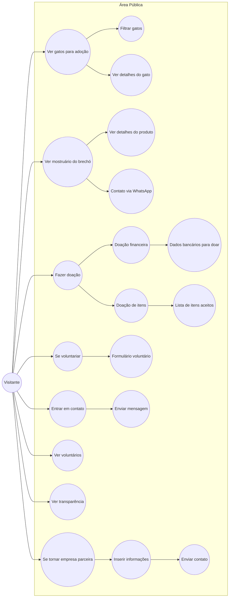
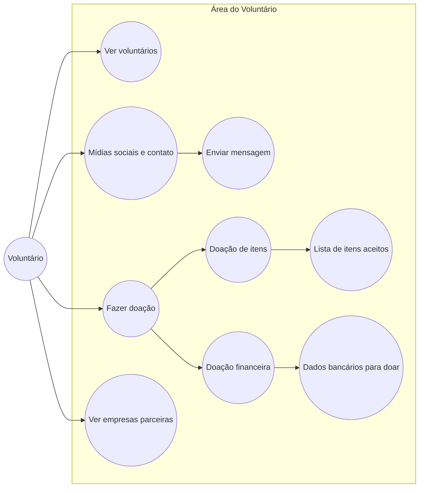
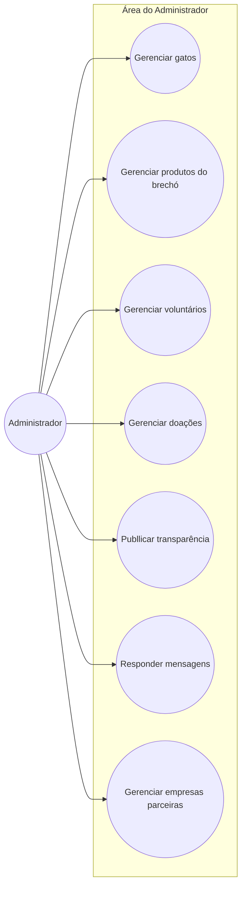
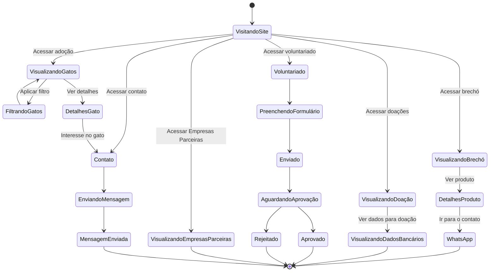
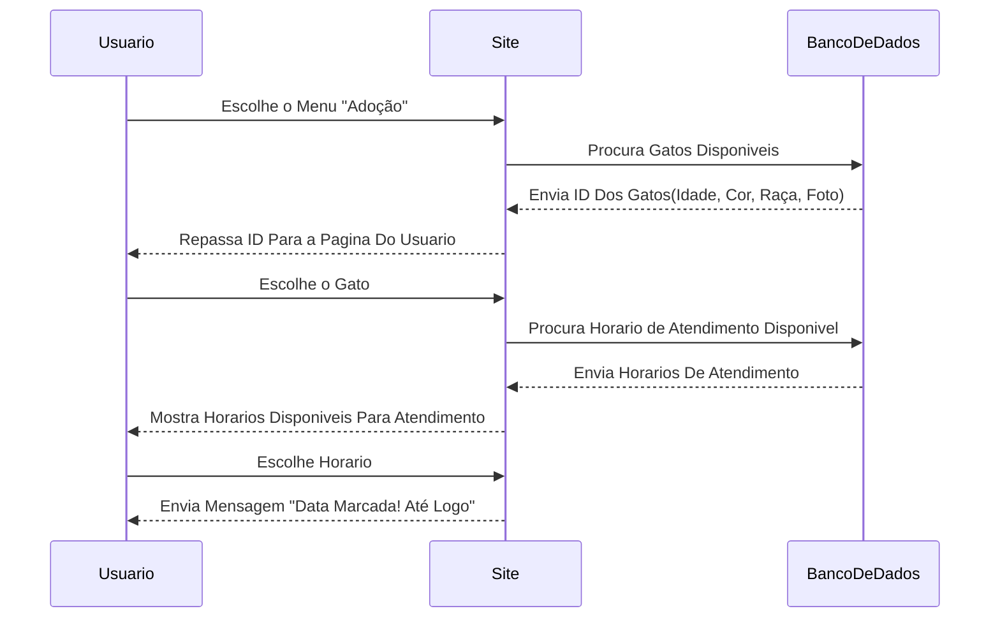
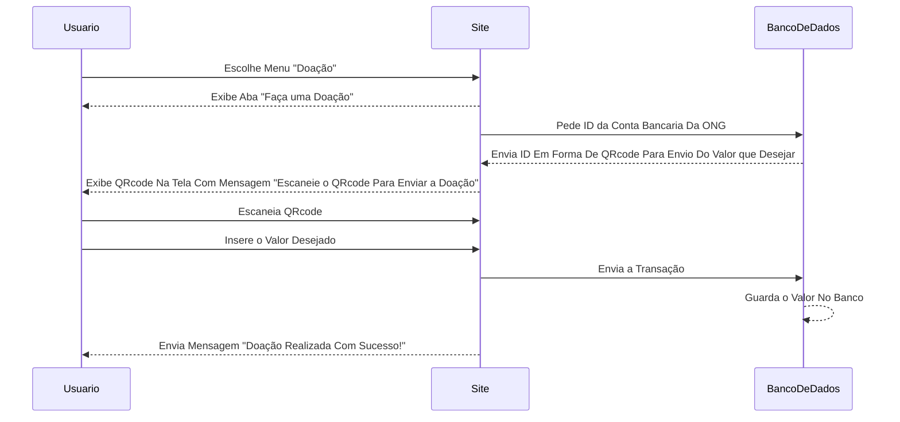
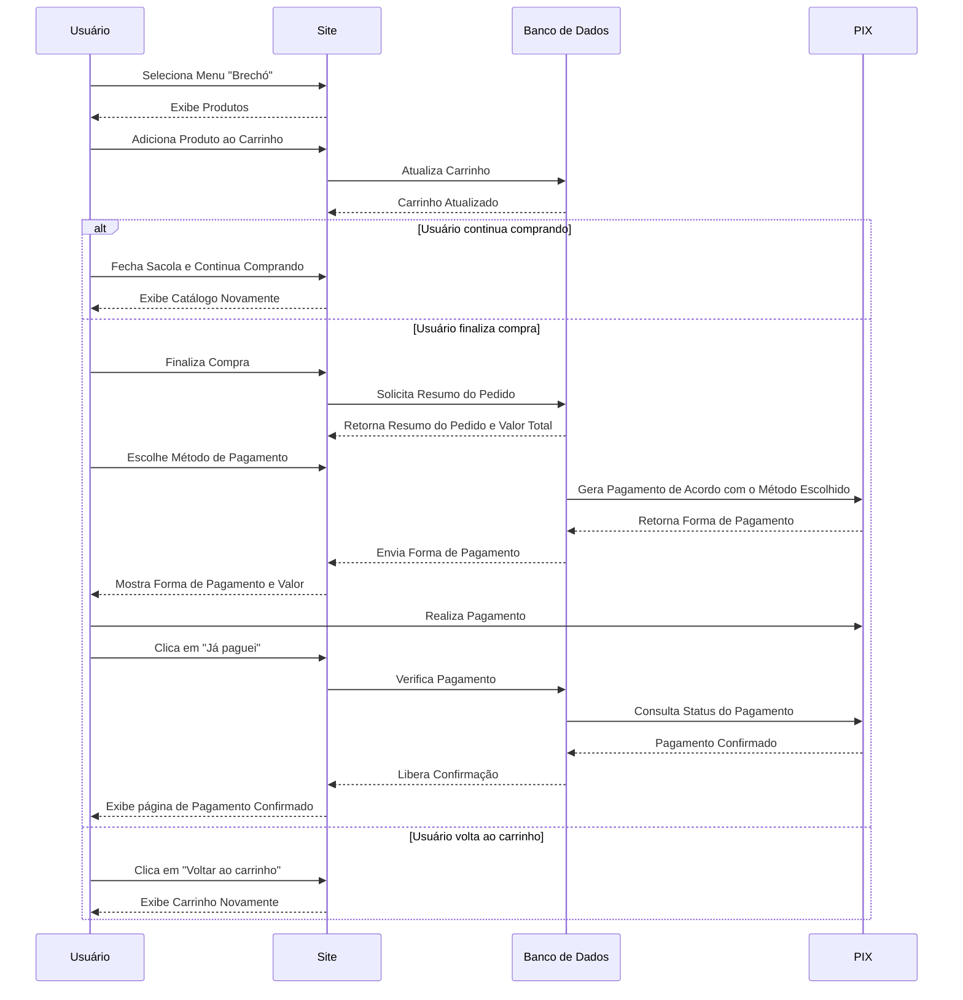
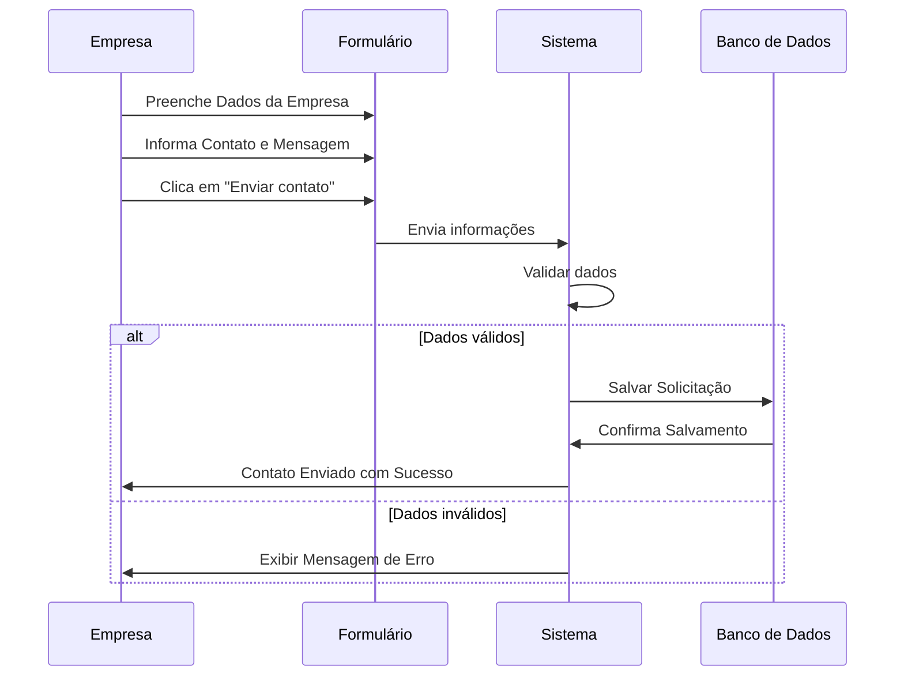
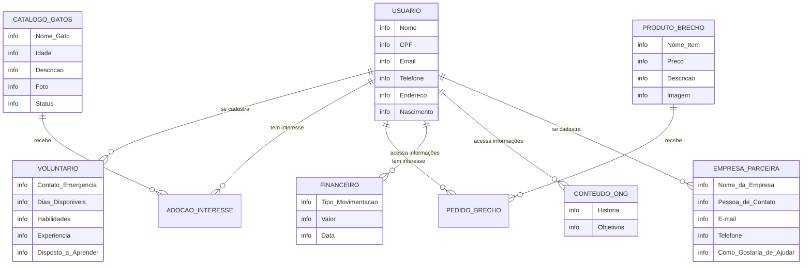
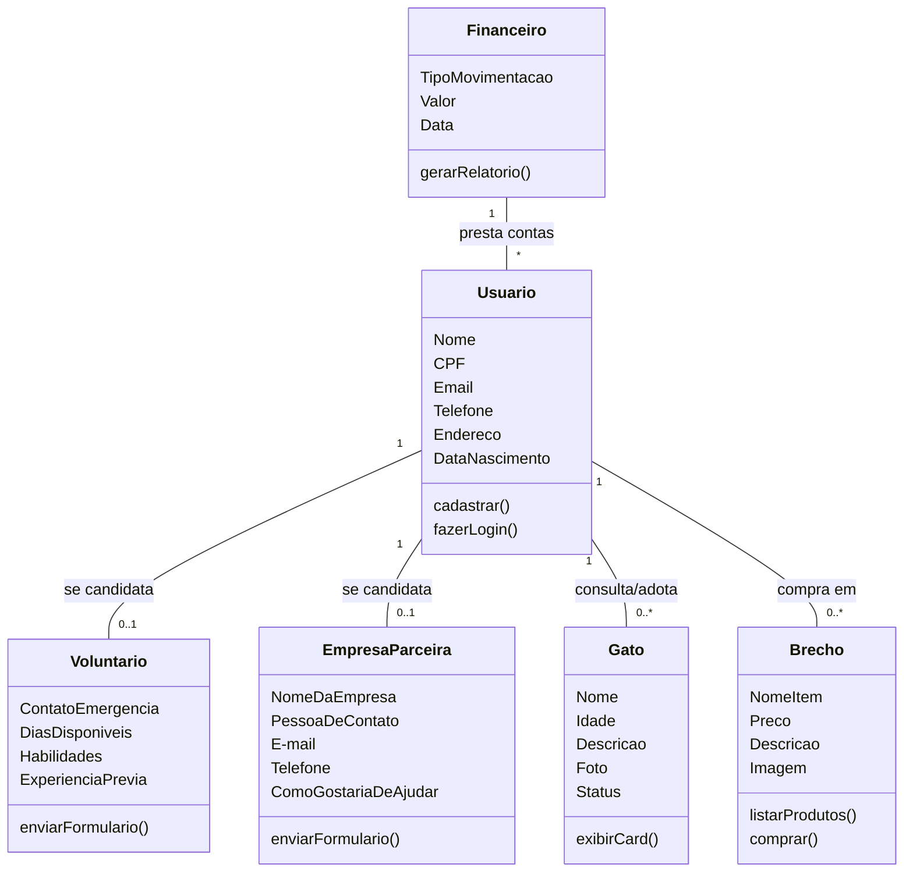

# 🐱 Casa dos Gatos - Projeto Web

## 📌 Sobre o Projeto

Este projeto foi desenvolvido por um grupo de 5 estudantes do curso de Análise e Desenvolvimento de Sistemas da FATEC Araraquara, com o objetivo de criar um site para a ONG **Casa dos Gatos**.

A ideia principal é ajudar a ONG a ter mais visibilidade, mostrando o trabalho que eles fazem no resgate, cuidado e adoção de gatos, além de facilitar a comunicação com voluntários e apoiadores.

---

## 🎯 Objetivo

Criar uma plataforma simples, organizada e acessível para:

* Divulgar o trabalho da ONG
* Aumentar o número de adoções
* Atrair voluntários
* Facilitar doações e apoio financeiro

---

## 🧩 Funcionalidades do Site

O site contará com as seguintes páginas:

* **Sobre Nós**
  Informações sobre a ONG, sua história e missão.

* **Voluntários**
  Apresentação das pessoas que já ajudam o projeto.

* **Voluntarie-se**
  Formulário para novos interessados participarem como voluntários.

* **Como Ajudar**
  Explicação de formas de contribuição (doações, serviços, etc).

* **Portal da Transparência**
  Informações financeiras e prestação de contas da ONG.

* **Gatos para Adoção** 🐾
  Lista de gatos disponíveis, com fotos e informações.

* **Brechó Online** 🛍️
  Venda de produtos para arrecadar fundos para a ONG.

  ---

## 🛠️ Tecnologias Utilizadas

---

## 👨‍💻 Equipe

Projeto desenvolvido por estudantes da FATEC Araraquara:

* Carlos Eduardo Fagian Filho
* João Pedro de Oliveira
* Ligia Cristina de Oliveira
* Manoela Zanin Zanardi
* Walisson Rodrigues Dos Santos

---

## 🚀 Status do Projeto

🟡 Em desenvolvimento

---

## 💡 Considerações Finais

Esse projeto foi pensado não só como atividade acadêmica, mas também como uma forma de contribuir com uma causa importante. Esperamos que o sistema ajude a ONG a alcançar mais pessoas e, principalmente, encontrar lares para muitos gatinhos ❤️🐱

---
## Diagramas de Caso de Uso

### 👤 Visitante [(LinkRaw)](https://raw.githubusercontent.com/ligiaoliveira/Casa-dos-Gatos/refs/heads/main/docs/diagramas/casos_visitante.md)

```mermaid
flowchart LR
    Visitante((Visitante))

    subgraph Área Pública
        UC1((Ver gatos para adoção))
        UC2((Ver mostruário do brechó))
        UC3((Fazer doação))
        UC4((Se voluntariar))
        UC5((Entrar em contato))
        UC6((Ver voluntários))
        UC7((Ver transparência))
        UC8((Filtrar gatos))
        UC9((Ver detalhes do gato))
        UC10((Ver detalhes do produto))
        UC11((Contato via WhatsApp))
        UC12((Formulário voluntário))
        UC13((Doação financeira))
        UC14((Enviar mensagem))
        UC15((Doação de itens))
        UC16((Lista de itens aceitos))
        UC17((Dados bancários para doar))
        UC18((Se tornar empresa parceira))
        UC19((Inserir informações))
        UC20((Enviar contato))
    end

    Visitante --> UC1
    Visitante --> UC2
    Visitante --> UC3
    Visitante --> UC4
    Visitante --> UC5
    Visitante --> UC6
    Visitante --> UC7
    Visitante --> UC18

    UC1 --> UC8
    UC1 --> UC9
    UC2 --> UC10
    UC2 --> UC11
    UC3 --> UC13
    UC3 --> UC15
    UC4 --> UC12
    UC5 --> UC14
    UC13 --> UC17
    UC15 --> UC16
    UC18 --> UC19
    UC19 --> UC20
```
---

### 🙋 Voluntário [(LinkRaw)](https://raw.githubusercontent.com/ligiaoliveira/Casa-dos-Gatos/refs/heads/main/docs/diagramas/casos_voluntario.md)

```mermaid
flowchart LR
    Voluntário((Voluntário))

    subgraph Área do Voluntário
        UC1((Ver voluntários))
        UC2((Mídias sociais e contato))
        UC3((Fazer doação))
        UC4((Enviar mensagem))
        UC5((Doação financeira))
        UC6((Doação de itens))
        UC7((Lista de itens aceitos))
        UC8((Dados bancários para doar))
        UC9((Ver empresas parceiras))
    end

    Voluntário --> UC1
    Voluntário --> UC2
    Voluntário --> UC3
    Voluntário --> UC9

    UC2 --> UC4
    UC3 --> UC5
    UC3 --> UC6
    UC5 --> UC8
    UC6 --> UC7
    
```
---

### 🔐 Administrador [(LinkRaw)](https://github.com/ligiaoliveira/Casa-dos-Gatos/raw/refs/heads/main/docs/diagramas/casos_admin.md)

```mermaid
flowchart LR
  Administrador((Administrador))

  subgraph Área do Administrador
      UC1((Gerenciar gatos))
      UC2((Gerenciar produtos do brechó))
      UC3((Gerenciar voluntários))
      UC4((Gerenciar doações))
      UC5((Publlicar transparência))
      UC6((Responder mensagens))
      UC7((Gerenciar empresas parceiras))
  end

  Administrador --> UC1
  Administrador --> UC2
  Administrador --> UC3
  Administrador --> UC4
  Administrador --> UC5
  Administrador --> UC6
  Administrador --> UC7

```
---

## Diagrama de Estados

### 👤 Visitante [(LinkRaw)](https://github.com/ligiaoliveira/Casa-dos-Gatos/raw/refs/heads/main/docs/diagramas/estados_visitante.md)

```mermaid
stateDiagram-v2

  [*] --> VisitandoSite

  VisitandoSite --> VisualizandoGatos : Acessar adoção
  VisitandoSite --> VisualizandoBrechó : Acessar brechó
  VisitandoSite --> VisualizandoDoação : Acessar doações
  VisitandoSite --> Voluntariado : Acessar voluntariado
  VisitandoSite --> VisualizandoEmpresasParceiras : Acessar Empresas Parceiras
  VisitandoSite --> Contato : Acessar contato

  %% Gatos
  VisualizandoGatos --> FiltrandoGatos : Aplicar filtro
  FiltrandoGatos --> VisualizandoGatos
  VisualizandoGatos --> DetalhesGato : Ver detalhes
  DetalhesGato --> Contato : Interesse no gato

  %% Brechó
  VisualizandoBrechó --> DetalhesProduto : Ver produto
  DetalhesProduto --> WhatsApp : Ir para o contato
  WhatsApp --> [*]

  %% Doação
  VisualizandoDoação --> VisualizandoDadosBancários : Ver dados para doação
  VisualizandoDadosBancários --> [*]

  %% Voluntariado
  Voluntariado --> PreenchendoFormulário
  PreenchendoFormulário --> Enviado
  Enviado --> AguardandoAprovação
  AguardandoAprovação --> Aprovado
  AguardandoAprovação --> Rejeitado
  Aprovado --> [*]
  Rejeitado --> [*]

  %% Empresas Parceiras
  VisualizandoEmpresasParceiras --> [*]

  %% Contato
  Contato --> EnviandoMensagem
  EnviandoMensagem --> MensagemEnviada
  MensagemEnviada --> [*]
```
---

### 🙋 Voluntário [(LinkRaw)](https://www.google.com/search?q=https://raw.githubusercontent.com/ligiaoliveira/Casa-dos-Gatos/main/docs/diagramas/estados_voluntario.md)

```mermaid
stateDiagram-v2

  [*] --> AcessandoSite

  AcessandoSite --> VisualizandoInformações
  VisualizandoInformações --> VisualizandoVoluntários
  VisualizandoInformações --> EntrandoEmContato
  VisualizandoInformações --> VisualizandoEmpresasPaceiras

  %% Contato
  EntrandoEmContato --> EnviandoMensagem
  EnviandoMensagem --> MensagemEnviada
  MensagemEnviada --> [*]

  %% Visualização
  VisualizandoVoluntários --> [*]
  VisualizandoEmpresasPaceiras --> [*]
  ```
---

### 🔐 Administrador [(LinkRaw)](https://github.com/ligiaoliveira/Casa-dos-Gatos/raw/refs/heads/main/docs/diagramas/estados_admin.md)

```mermaid
stateDiagram-v2

  [*] --> Login
  Login --> PainelAdmin : Login válido
  Login --> [*] : login inválido

  %% HUB CENTRAL
  state PainelAdmin
  
  %% Distribuição equilibrada
  PainelAdmin --> GerenciandoGatos
  PainelAdmin --> GerenciandoProdutos
  PainelAdmin --> GerenciandoVoluntários
  PainelAdmin --> GerenciandoEmpresasParceiras
  PainelAdmin --> GerenciandoDoações
  PainelAdmin --> PublicandoTransparência
  PainelAdmin --> RespondendoMensagens

  %% Retornos
  GerenciandoGatos --> PainelAdmin
  GerenciandoProdutos --> PainelAdmin
  GerenciandoVoluntários --> PainelAdmin
  GerenciandoEmpresasParceiras --> PainelAdmin
  GerenciandoDoações --> PainelAdmin
  PublicandoTransparência --> PainelAdmin
  RespondendoMensagens --> PainelAdmin

  %% Gatos
  GerenciandoGatos --> CadastrandoGato
  GerenciandoGatos --> EditandoGato
  GerenciandoGatos --> RemovendoGato
  CadastrandoGato --> GerenciandoGatos
  EditandoGato --> GerenciandoGatos
  RemovendoGato --> GerenciandoGatos

  %% Produtos
  GerenciandoProdutos --> CadastrandoProduto
  GerenciandoProdutos --> EditandoProduto
  GerenciandoProdutos --> RemovendoProduto
  CadastrandoProduto --> GerenciandoProdutos
  EditandoProduto --> GerenciandoProdutos
  RemovendoProduto --> GerenciandoProdutos

  %% Voluntários
  GerenciandoVoluntários --> AnalisandoCadastro
  AnalisandoCadastro --> Aprovado
  AnalisandoCadastro --> Rejeitado
  Aprovado --> GerenciandoVoluntários
  Rejeitado --> GerenciandoVoluntários

  %% Empresas Parceiras
  GerenciandoEmpresasParceiras --> AnalisandoCadastro
  AnalisandoCadastro --> Aprovado
  AnalisandoCadastro --> Rejeitado
  Aprovado --> GerenciandoEmpresasParceiras
  Rejeitado --> GerenciandoEmpresasParceiras

  %% Doações
  GerenciandoDoações --> VisualizandoDoações
  VisualizandoDoações --> GerenciandoDoações

  %% Transparência
  PublicandoTransparência --> PublicaçãoRealizada
  PublicaçãoRealizada --> PainelAdmin

  %% Mensagens
  RespondendoMensagens --> MensagemRespondida
  MensagemRespondida --> PainelAdmin

  PainelAdmin --> [*] : logout
```
---

## Diagramas de Sequência

### 🐈 Adotar [(LinkRaw)](https://raw.githubusercontent.com/ligiaoliveira/Casa-dos-Gatos/refs/heads/main/docs/diagramas/sequencia_adocao.md)

```mermaid
sequenceDiagram
participant U as Usuario
participant S as Site
participant B as BancoDeDados
U->>S:Escolhe o Menu "Adoção"
S->>B:Procura Gatos Disponiveis
B-->>S:Envia ID Dos Gatos(Idade, Cor, Raça, Foto)
S-->>U:Repassa ID Para a Pagina Do Usuario
U->>S:Escolhe o Gato
S->>B:Procura Horario de Atendimento Disponivel
B-->>S: Envia Horarios De Atendimento
S-->>U: Mostra Horarios Disponiveis Para Atendimento
U->>S: Escolhe Horario
S-->>U: Envia Mensagem "Data Marcada! Até Logo"
```
---

### 💸 Doar [(LinkRaw)](https://raw.githubusercontent.com/ligiaoliveira/Casa-dos-Gatos/refs/heads/main/docs/diagramas/sequencia_doacao.md)

```mermaid
sequenceDiagram
participant U as Usuario
participant S as Site
participant B as BancoDeDados
U->>S:Escolhe Menu "Doação"
S-->>U:Exibe Aba "Faça uma Doação"
S->>B:Pede ID da Conta Bancaria Da ONG
B-->>S: Envia ID Em Forma De QRcode Para Envio Do Valor que Desejar
S-->>U:Exibe QRcode Na Tela Com Mensagem "Escaneie o QRcode Para Enviar a Doação"
U->>S:Escaneia QRcode
U->>S:Insere o Valor Desejado
S->>B: Envia a Transação
B-->>B:Guarda o Valor No Banco
S-->>U: Envia Mensagem "Doação Realizada Com Sucesso!"
```
---

### 🛍 Brécho [(LinkRaw)](https://raw.githubusercontent.com/ligiaoliveira/Casa-dos-Gatos/refs/heads/main/docs/diagramas/sequencia_brecho.md)

```mermaid
sequenceDiagram
    participant U as Usuário 
    participant S as Site
    participant B as Banco de Dados
    participant P as PIX

U->>S: Seleciona Menu "Brechó"
S-->>U: Exibe Produtos
U->>S: Adiciona Produto ao Carrinho
S->>B: Atualiza Carrinho
B-->>S: Carrinho Atualizado

alt Usuário continua comprando
U->>S: Fecha Sacola e Continua Comprando
S-->>U: Exibe Catálogo Novamente

else Usuário finaliza compra
U->>S: Finaliza Compra
S->>B: Solicita Resumo do Pedido
B-->>S: Retorna Resumo do Pedido e Valor Total
U->>S:Escolhe Método de Pagamento
B->>P: Gera Pagamento de Acordo com o Método Escolhido
P-->>B: Retorna Forma de Pagamento
B-->>S: Envia Forma de Pagamento
S-->>U: Mostra Forma de Pagamento e Valor
U->>P: Realiza Pagamento
U->>S: Clica em "Já paguei"
S->>B: Verifica Pagamento
B->>P: Consulta Status do Pagamento
P-->>B: Pagamento Confirmado
B-->>S: Libera Confirmação
S-->>U: Exibe página de Pagamento Confirmado

else Usuário volta ao carrinho
U->>S: Clica em "Voltar ao carrinho"
S-->>U: Exibe Carrinho Novamente
end
```
---
### Empresa Parceira 🏢

```mermaid
sequenceDiagram
    participant E as Empresa
    participant F as Formulário
    participant S as Sistema
    participant B as Banco de Dados

    E->>F: Preenche Dados da Empresa
    E->>F: Informa Contato e Mensagem
    E->>F: Clica em "Enviar contato"
    F->>S: Envia informações
    S->>S: Validar dados

    alt Dados válidos
        S->>B: Salvar Solicitação
        B->>S: Confirma Salvamento
        S->>E: Contato Enviado com Sucesso
        
    else Dados inválidos
        S ->> E: Exibir Mensagem de Erro
    end
```
---

## 📁Diagrama de Entidade/Relacionamento [(LinkRaw)](https://github.com/ligiaoliveira/Casa-dos-Gatos/raw/refs/heads/main/docs/diagramas/diagrama_er.md)

```mermaid
erDiagram
    USUARIO ||--o{ VOLUNTARIO : "se cadastra"
    USUARIO ||--o{ ADOCAO_INTERESSE : "tem interesse"
    USUARIO ||--o{ PEDIDO_BRECHO : "tem interesse"
    USUARIO ||--o{ FINANCEIRO : "acessa informações"
    USUARIO ||--o{ CONTEUDO_ONG : "acessa informações"
    USUARIO ||--o{ EMPRESA_PARCEIRA : "se cadastra"
    
    CATALOGO_GATOS ||--o{ ADOCAO_INTERESSE : "recebe"
    PRODUTO_BRECHO ||--o{ PEDIDO_BRECHO : "recebe"

    USUARIO {
        info Nome
        info CPF
        info Email
        info Telefone
        info Endereco
        info Nascimento
    }

    VOLUNTARIO {
        info Contato_Emergencia
        info Dias_Disponiveis
        info Habilidades
        info Experiencia
        info Disposto_a_Aprender
    }

    CATALOGO_GATOS {
        info Nome_Gato
        info Idade
        info Descricao
        info Foto
        info Status
    }

    PRODUTO_BRECHO {
        info Nome_Item
        info Preco
        info Descricao
        info Imagem
    }

    FINANCEIRO {
        info Tipo_Movimentacao
        info Valor
        info Data
    }

    CONTEUDO_ONG {
        info Historia
        info Objetivos
    }
    
    EMPRESA_PARCEIRA {
        info Nome_da_Empresa
        info Pessoa_de_Contato
        info E-mail
        info Telefone
        info Como_Gostaria_de_Ajudar
    }

```
---
## 📁Diagrama De Classe [(LinkRaw)](https://github.com/ligiaoliveira/Casa-dos-Gatos/raw/refs/heads/main/docs/diagramas/diagrama_classe.md)

```mermaid 
classDiagram
    class Usuario {
        Nome
        CPF
        Email
        Telefone
        Endereco
        DataNascimento
        cadastrar()
        fazerLogin()
    }

    class Voluntario {
        ContatoEmergencia
        DiasDisponiveis
        Habilidades
        ExperienciaPrevia
        enviarFormulario()
    }

    class Empresa Parceira {
        NomeDaEmpresa
        PessoaDeContato
        E-mail
        Telefone
        ComoGostariaDeAjudar
        enviarFormulario()
    }

    class Gato {
        Nome
        Idade
        Descricao
        Foto
        Status
        exibirCard()
    }

    class Brecho {
        NomeItem
        Preco
        Descricao
        Imagem
        listarProdutos()
        comprar()
    }

    class Financeiro {
        TipoMovimentacao
        Valor
        Data
        gerarRelatorio()
    }

    Usuario "1" -- "0..1" Voluntario : se candidata
    Usuario "1" -- "0..1" Empresa Parceira : se candidata
    Usuario "1" -- "0..*" Gato : consulta/adota
    Usuario "1" -- "0..*" Brecho : compra em
    Financeiro "1" -- "*" Usuario : presta contas
```
---

## 📝 Projeto Interface

---

## 📊 Tabela de Dados
### Gatos

### Voluntários

### Doações

### Transparência

---
> Projeto acadêmico desenvolvido na FATEC Araraquara.
> 
