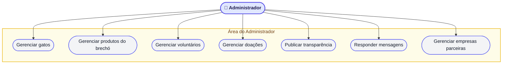

```mermaid
flowchart TD
    %% Estilo para melhorar nitidez e visual UML
    classDef ator fill:#e0e7ff,stroke:#4f46e5,stroke-width:2px,color:#1e1b4b,font-weight:bold;
    classDef caso fill:#f3f4f6,stroke:#6366f1,stroke-width:1.5px,color:#111827;

    Administrador([🔐 Administrador]):::ator

    subgraph AreaAdministrador ["Área do Administrador"]
        direction TB

        UC1([Gerenciar gatos]):::caso
        UC2([Gerenciar produtos do brechó]):::caso
        UC3([Gerenciar voluntários]):::caso
        UC4([Gerenciar doações]):::caso
        UC5([Publicar transparência]):::caso
        UC6([Responder mensagens]):::caso
        UC7([Gerenciar empresas parceiras]):::caso
    end

    %% Conexões do Administrador espalhadas horizontalmente
    Administrador --> UC1
    Administrador --> UC2
    Administrador --> UC3
    Administrador --> UC4
    Administrador --> UC5
    Administrador --> UC6
    Administrador --> UC7

    %% Estilo da caixa Área do Administrador
    style AreaAdministrador fill:#fefce8,stroke:#eab308,stroke-width:1.5px,color:#713f12
```
