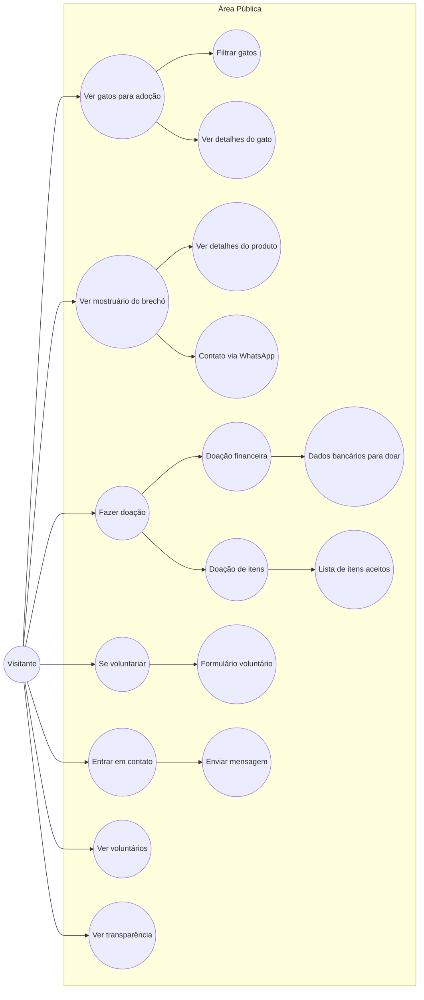

```mermaid
flowchart LR
    Visitante((Visitante))

    subgraph Área Pública
        UC1((Ver gatos para adoção))
        UC2((Ver mostruário do brechó))
        UC3((Fazer doação))
        UC4((Se voluntariar))
        UC5((Entrar em contato))
        UC6((Ver voluntários))
        UC7((Ver transparência))

        UC8((Filtrar gatos))
        UC9((Ver detalhes do gato))
        UC10((Ver detalhes do produto))
        UC11((Contato via WhatsApp))
        UC12((Formulário voluntário))
        UC13((Doação financeira))
        UC14((Enviar mensagem))
        UC15((Doação de itens))
        UC16((Lista de itens aceitos))
        UC17((Dados bancários para doar))
    end

    Visitante --> UC1
    Visitante --> UC2
    Visitante --> UC3
    Visitante --> UC4
    Visitante --> UC5
    Visitante --> UC6
    Visitante --> UC7

    UC1 --> UC8
    UC1 --> UC9
    UC2 --> UC10
    UC2 --> UC11
    UC3 --> UC13
    UC3 --> UC15
    UC4 --> UC12
    UC5 --> UC14
    UC13 --> UC17
    UC15 --> UC16
```
