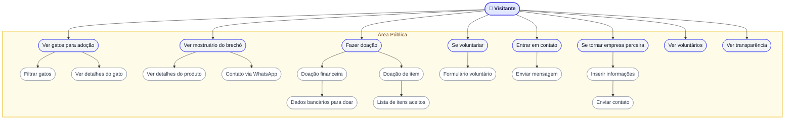

```mermaid
flowchart TD
    %% Estilo para melhorar nitidez e visual UML
    classDef ator fill:#e0e7ff,stroke:#4f46e5,stroke-width:2px,color:#1e1b4b,font-weight:bold;
    classDef caso fill:#f3f4f6,stroke:#6366f1,stroke-width:1.5px,color:#111827;
    classDef subcaso fill:#ffffff,stroke:#9ca3af,stroke-width:1px,color:#374151;

    Visitante([👤 Visitante]):::ator

    subgraph AreaPublica ["Área Pública"]
        direction TB

        %% Coluna 1: Adoção
        UC1([Ver gatos para adoção]):::caso
        UC1_1([Filtrar gatos]):::subcaso
        UC1_2([Ver detalhes do gato]):::subcaso
        UC1 --> UC1_1
        UC1 --> UC1_2

        %% Coluna 2: Brechó
        UC2([Ver mostruário do brechó]):::caso
        UC2_1([Ver detalhes do produto]):::subcaso
        UC2_2([Contato via WhatsApp]):::subcaso
        UC2 --> UC2_1
        UC2 --> UC2_2

        %% Coluna 3: Doação
        UC3([Fazer doação]):::caso
        UC3_1([Doação financeira]):::subcaso
        UC3_1_1([Dados bancários para doar]):::subcaso
        UC3_2([Doação de item]):::subcaso
        UC3_2_1([Lista de itens aceitos]):::subcaso
        UC3 --> UC3_1 --> UC3_1_1
        UC3 --> UC3_2 --> UC3_2_1

        %% Coluna 4: Voluntariado
        UC4([Se voluntariar]):::caso
        UC4_1([Formulário voluntário]):::subcaso
        UC4 --> UC4_1

        %% Coluna 5: Contato
        UC5([Entrar em contato]):::caso
        UC5_1([Enviar mensagem]):::subcaso
        UC5 --> UC5_1

        %% Coluna 6: Empresa Parceira
        UC6([Se tornar empresa parceira]):::caso
        UC6_1([Inserir informações]):::subcaso
        UC6_2([Enviar contato]):::subcaso
        UC6 --> UC6_1 --> UC6_2

        %% Coluna 7: Consultas Simples
        UC7([Ver voluntários]):::caso
        UC8([Ver transparência]):::caso
    end

    %% Conexões do Visitante espalhadas horizontalmente
    Visitante --> UC1
    Visitante --> UC2
    Visitante --> UC3
    Visitante --> UC4
    Visitante --> UC5
    Visitante --> UC6
    Visitante --> UC7
    Visitante --> UC8

    %% Estilo da caixa Área Pública
    style AreaPublica fill:#fefce8,stroke:#eab308,stroke-width:1.5px,color:#713f12
```
