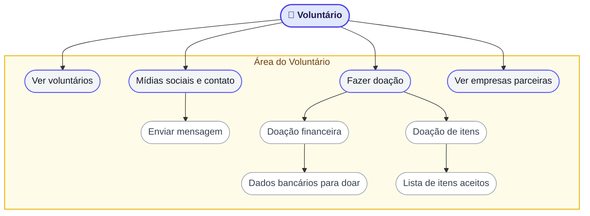

```mermaid
flowchart TD
    %% Estilo para melhorar nitidez e visual UML
    classDef ator fill:#e0e7ff,stroke:#4f46e5,stroke-width:2px,color:#1e1b4b,font-weight:bold;
    classDef caso fill:#f3f4f6,stroke:#6366f1,stroke-width:1.5px,color:#111827;
    classDef subcaso fill:#ffffff,stroke:#9ca3af,stroke-width:1px,color:#374151;

    Voluntario([🙋 Voluntário]):::ator

    subgraph AreaVoluntario ["Área do Voluntário"]
        direction TB

        %% Coluna 1: Consulta Simples
        UC1([Ver voluntários]):::caso

        %% Coluna 2: Contato
        UC2([Mídias sociais e contato]):::caso
        UC2_1([Enviar mensagem]):::subcaso
        UC2 --> UC2_1

        %% Coluna 3: Doação
        UC3([Fazer doação]):::caso
        UC3_1([Doação financeira]):::subcaso
        UC3_1_1([Dados bancários para doar]):::subcaso
        UC3_2([Doação de itens]):::subcaso
        UC3_2_1([Lista de itens aceitos]):::subcaso
        UC3 --> UC3_1 --> UC3_1_1
        UC3 --> UC3_2 --> UC3_2_1

        %% Coluna 4: Consulta Simples
        UC4([Ver empresas parceiras]):::caso
    end

    %% Conexões do Voluntário espalhadas horizontalmente
    Voluntario --> UC1
    Voluntario --> UC2
    Voluntario --> UC3
    Voluntario --> UC4

    %% Estilo da caixa Área do Voluntário
    style AreaVoluntario fill:#fefce8,stroke:#eab308,stroke-width:1.5px,color:#713f12
```
