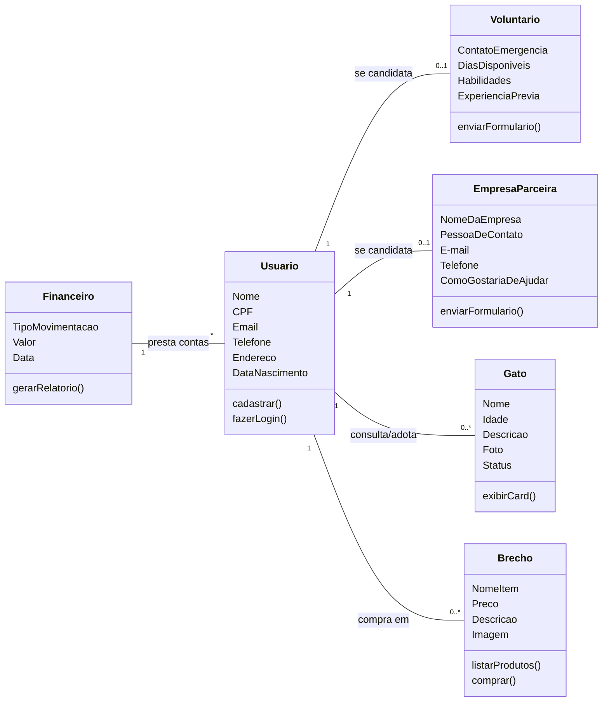

```mermaid 
classDiagram
    direction LR

    class Financeiro {
        TipoMovimentacao
        Valor
        Data
        gerarRelatorio()
    }

    class Usuario {
        Nome
        CPF
        Email
        Telefone
        Endereco
        DataNascimento
        cadastrar()
        fazerLogin()
    }

    class Voluntario {
        ContatoEmergencia
        DiasDisponiveis
        Habilidades
        ExperienciaPrevia
        enviarFormulario()
    }

    class EmpresaParceira {
        NomeDaEmpresa
        PessoaDeContato
        E-mail
        Telefone
        ComoGostariaDeAjudar
        enviarFormulario()
    }

    class Gato {
        Nome
        Idade
        Descricao
        Foto
        Status
        exibirCard()
    }

    class Brecho {
        NomeItem
        Preco
        Descricao
        Imagem
        listarProdutos()
        comprar()
    }

    Financeiro "1" -- "*" Usuario : presta contas
    Usuario "1" -- "0..1" Voluntario : se candidata
    Usuario "1" -- "0..1" EmpresaParceira : se candidata
    Usuario "1" -- "0..*" Gato : consulta/adota
    Usuario "1" -- "0..*" Brecho : compra em
```
