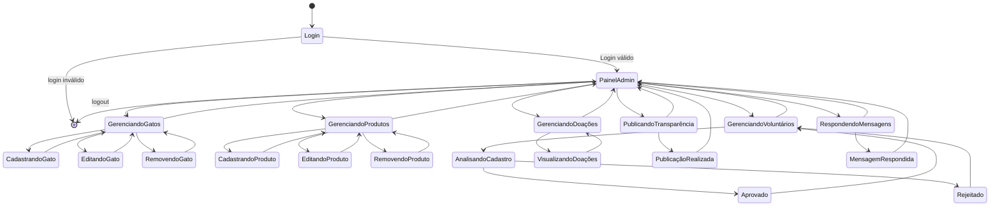

```mermaid
stateDiagram-v2

  [*] --> Login
  Login --> PainelAdmin : Login válido
  Login --> [*] : login inválido

  %% HUB CENTRAL
  state PainelAdmin
  
  %% Distribuição equilibrada
  PainelAdmin --> GerenciandoGatos
  PainelAdmin --> GerenciandoProdutos
  PainelAdmin --> GerenciandoVoluntários
  PainelAdmin --> GerenciandoDoações
  PainelAdmin --> PublicandoTransparência
  PainelAdmin --> RespondendoMensagens

  %% Retornos
  GerenciandoGatos --> PainelAdmin
  GerenciandoProdutos --> PainelAdmin
  GerenciandoVoluntários --> PainelAdmin
  GerenciandoDoações --> PainelAdmin
  PublicandoTransparência --> PainelAdmin
  RespondendoMensagens --> PainelAdmin

  %% Gatos
  GerenciandoGatos --> CadastrandoGato
  GerenciandoGatos --> EditandoGato
  GerenciandoGatos --> RemovendoGato
  CadastrandoGato --> GerenciandoGatos
  EditandoGato --> GerenciandoGatos
  RemovendoGato --> GerenciandoGatos

  %% Produtos
  GerenciandoProdutos --> CadastrandoProduto
  GerenciandoProdutos --> EditandoProduto
  GerenciandoProdutos --> RemovendoProduto
  CadastrandoProduto --> GerenciandoProdutos
  EditandoProduto --> GerenciandoProdutos
  RemovendoProduto --> GerenciandoProdutos

  %% Voluntários
  GerenciandoVoluntários --> AnalisandoCadastro
  AnalisandoCadastro --> Aprovado
  AnalisandoCadastro --> Rejeitado
  Aprovado --> GerenciandoVoluntários
  Rejeitado --> GerenciandoVoluntários

  %% Doações
  GerenciandoDoações --> VisualizandoDoações
  VisualizandoDoações --> GerenciandoDoações

  %% Transparência
  PublicandoTransparência --> PublicaçãoRealizada
  PublicaçãoRealizada --> PainelAdmin

  %% Mensagens
  RespondendoMensagens --> MensagemRespondida
  MensagemRespondida --> PainelAdmin

  PainelAdmin --> [*] : logout
```
