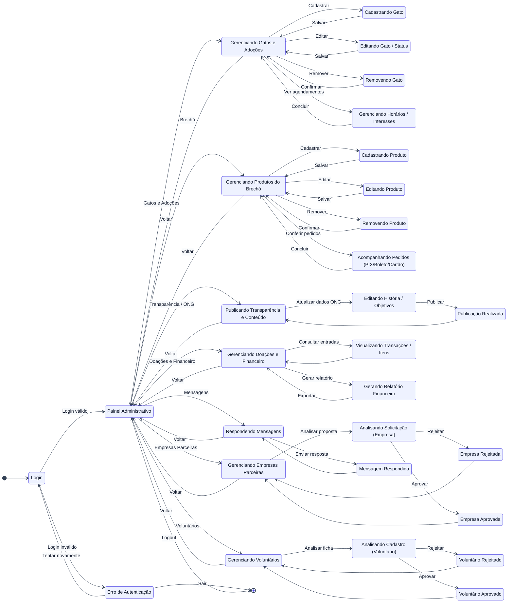

```mermaid
%%{init: {'theme': 'base', 'themeVariables': {'fontSize': '16px', 'fontFamily': 'arial', 'primaryColor': '#eef2ff', 'primaryBorderColor': '#4f46e5', 'primaryTextColor': '#0f172a', 'lineColor': '#334155', 'edgeLabelBackground': '#f8fafc'}, 'state': {'nodeSpacing': 75, 'rankSpacing': 75, 'padding': 14}, 'flowchart': {'nodeSpacing': 75, 'rankSpacing': 75}}}%%
stateDiagram-v2
    direction LR

    %% Autenticação e Painel
    state "Login" as Login
    state "Erro de Autenticação" as LoginInvalido
    state "Painel Administrativo" as PainelAdmin

    %% 1. Módulo Gatos e Adoções
    state "Gerenciando Gatos e Adoções" as GerenciandoGatos
    state "Cadastrando Gato" as CadastrandoGato
    state "Editando Gato / Status" as EditandoGato
    state "Removendo Gato" as RemovendoGato
    state "Gerenciando Horários / Interesses" as GerenciandoAdocoes

    %% 2. Módulo Brechó e Pedidos
    state "Gerenciando Produtos do Brechó" as GerenciandoProdutos
    state "Cadastrando Produto" as CadastrandoProduto
    state "Editando Produto" as EditandoProduto
    state "Removendo Produto" as RemovendoProduto
    state "Acompanhando Pedidos (PIX/Boleto/Cartão)" as GerenciandoPedidos

    %% 3. Módulo Voluntários
    state "Gerenciando Voluntários" as GerenciandoVoluntarios
    state "Analisando Cadastro (Voluntário)" as AnalisandoVol
    state "Voluntário Aprovado" as VolAprovado
    state "Voluntário Rejeitado" as VolRejeitado

    %% 4. Módulo Empresas Parceiras
    state "Gerenciando Empresas Parceiras" as GerenciandoEmpresas
    state "Analisando Solicitação (Empresa)" as AnalisandoEmp
    state "Empresa Aprovada" as EmpAprovada
    state "Empresa Rejeitada" as EmpRejeitada

    %% 5. Módulo Doações e Financeiro
    state "Gerenciando Doações e Financeiro" as GerenciandoDoacoes
    state "Visualizando Transações / Itens" as VisualizandoDoacoes
    state "Gerando Relatório Financeiro" as GerandoRelatorio

    %% 6. Módulo Transparência e Conteúdo ONG
    state "Publicando Transparência e Conteúdo" as PublicandoTransparencia
    state "Editando História / Objetivos" as EditandoConteudo
    state "Publicação Realizada" as PublicacaoRealizada

    %% 7. Módulo Mensagens
    state "Respondendo Mensagens" as RespondendoMensagens
    state "Mensagem Respondida" as MensagemRespondida

    %% Início e Login
    [*] --> Login
    Login --> PainelAdmin : Login válido
    Login --> LoginInvalido : Login inválido
    LoginInvalido --> Login : Tentar novamente
    LoginInvalido --> [*] : Sair
    PainelAdmin --> [*] : Logout

    %% Ramificações a partir do Painel Admin
    PainelAdmin --> GerenciandoGatos : Gatos e Adoções
    PainelAdmin --> GerenciandoProdutos : Brechó
    PainelAdmin --> GerenciandoVoluntarios : Voluntários
    PainelAdmin --> GerenciandoEmpresas : Empresas Parceiras
    PainelAdmin --> GerenciandoDoacoes : Doações e Financeiro
    PainelAdmin --> PublicandoTransparencia : Transparência / ONG
    PainelAdmin --> RespondendoMensagens : Mensagens

    %% 1. Fluxo Gatos e Adoções
    GerenciandoGatos --> CadastrandoGato : Cadastrar
    CadastrandoGato --> GerenciandoGatos : Salvar
    GerenciandoGatos --> EditandoGato : Editar
    EditandoGato --> GerenciandoGatos : Salvar
    GerenciandoGatos --> RemovendoGato : Remover
    RemovendoGato --> GerenciandoGatos : Confirmar
    GerenciandoGatos --> GerenciandoAdocoes : Ver agendamentos
    GerenciandoAdocoes --> GerenciandoGatos : Concluir
    GerenciandoGatos --> PainelAdmin : Voltar

    %% 2. Fluxo Brechó e Pedidos
    GerenciandoProdutos --> CadastrandoProduto : Cadastrar
    CadastrandoProduto --> GerenciandoProdutos : Salvar
    GerenciandoProdutos --> EditandoProduto : Editar
    EditandoProduto --> GerenciandoProdutos : Salvar
    GerenciandoProdutos --> RemovendoProduto : Remover
    RemovendoProduto --> GerenciandoProdutos : Confirmar
    GerenciandoProdutos --> GerenciandoPedidos : Conferir pedidos
    GerenciandoPedidos --> GerenciandoProdutos : Concluir
    GerenciandoProdutos --> PainelAdmin : Voltar

    %% 3. Fluxo Voluntários
    GerenciandoVoluntarios --> AnalisandoVol : Analisar ficha
    AnalisandoVol --> VolAprovado : Aprovar
    AnalisandoVol --> VolRejeitado : Rejeitar
    VolAprovado --> GerenciandoVoluntarios
    VolRejeitado --> GerenciandoVoluntarios
    GerenciandoVoluntarios --> PainelAdmin : Voltar

    %% 4. Fluxo Empresas Parceiras (separado para evitar cruzamento de linhas)
    GerenciandoEmpresas --> AnalisandoEmp : Analisar proposta
    AnalisandoEmp --> EmpAprovada : Aprovar
    AnalisandoEmp --> EmpRejeitada : Rejeitar
    EmpAprovada --> GerenciandoEmpresas
    EmpRejeitada --> GerenciandoEmpresas
    GerenciandoEmpresas --> PainelAdmin : Voltar

    %% 5. Fluxo Doações e Financeiro
    GerenciandoDoacoes --> VisualizandoDoacoes : Consultar entradas
    VisualizandoDoacoes --> GerenciandoDoacoes
    GerenciandoDoacoes --> GerandoRelatorio : Gerar relatório
    GerandoRelatorio --> GerenciandoDoacoes : Exportar
    GerenciandoDoacoes --> PainelAdmin : Voltar

    %% 6. Fluxo Transparência e Conteúdo da ONG
    PublicandoTransparencia --> EditandoConteudo : Atualizar dados ONG
    EditandoConteudo --> PublicacaoRealizada : Publicar
    PublicacaoRealizada --> PublicandoTransparencia
    PublicandoTransparencia --> PainelAdmin : Voltar

    %% 7. Fluxo Mensagens
    RespondendoMensagens --> MensagemRespondida : Enviar resposta
    MensagemRespondida --> RespondendoMensagens
    RespondendoMensagens --> PainelAdmin : Voltar
```
