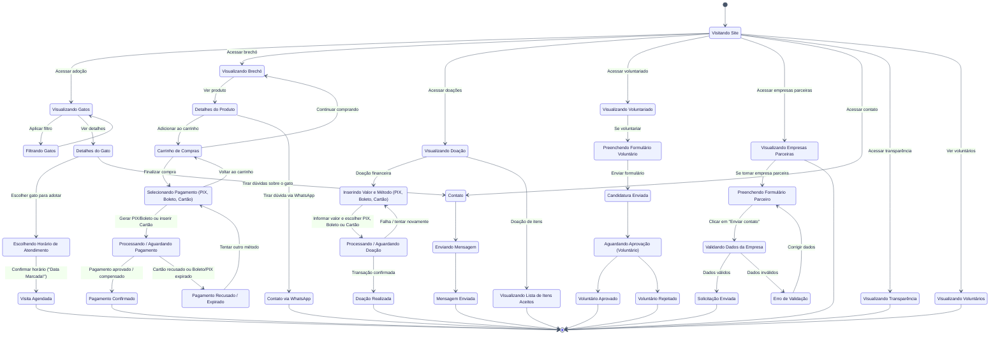

```mermaid
%%{init: {'theme': 'base', 'themeVariables': {'fontSize': '14px', 'primaryColor': '#eef2ff', 'primaryBorderColor': '#4f46e5', 'primaryTextColor': '#1e1b4b', 'lineColor': '#475569'}, 'flowchart': {'nodeSpacing': 50, 'rankSpacing': 65}}}%%
stateDiagram-v2
    direction TB

    %% Estados Principais
    state "Visitando Site" as VisitandoSite
    state "Visualizando Transparência" as VisualizandoTransparencia
    state "Visualizando Voluntários" as VisualizandoVoluntarios

    %% 1. Estados de Adoção
    state "Visualizando Gatos" as VisualizandoGatos
    state "Filtrando Gatos" as FiltrandoGatos
    state "Detalhes do Gato" as DetalhesGato
    state "Escolhendo Horário de Atendimento" as EscolhendoHorario
    state "Visita Agendada" as VisitaAgendada

    %% 2. Estados de Brechó
    state "Visualizando Brechó" as VisualizandoBrecho
    state "Detalhes do Produto" as DetalhesProduto
    state "Carrinho de Compras" as CarrinhoCompras
    state "Selecionando Pagamento (PIX, Boleto, Cartão)" as SelecionandoPagamentoBrecho
    state "Processando / Aguardando Pagamento" as AguardandoPagamentoBrecho
    state "Pagamento Confirmado" as PagamentoConfirmado
    state "Pagamento Recusado / Expirado" as PagamentoFalhouBrecho
    state "Contato via WhatsApp" as WhatsApp

    %% 3. Estados de Doação
    state "Visualizando Doação" as VisualizandoDoacao
    state "Inserindo Valor e Método (PIX, Boleto, Cartão)" as MetodoDoacao
    state "Processando / Aguardando Doação" as AguardandoDoacao
    state "Doação Realizada" as DoacaoRealizada
    state "Visualizando Lista de Itens Aceitos" as ListaItens

    %% 4. Estados de Voluntariado
    state "Visualizando Voluntariado" as Voluntariado
    state "Preenchendo Formulário Voluntário" as FormVoluntario
    state "Candidatura Enviada" as CandidaturaVolEnviada
    state "Aguardando Aprovação (Voluntário)" as AguardandoVol
    state "Voluntário Aprovado" as VolAprovado
    state "Voluntário Rejeitado" as VolRejeitado

    %% 5. Estados de Empresa Parceira
    state "Visualizando Empresas Parceiras" as VisualizandoEmpresas
    state "Preenchendo Formulário Parceiro" as FormEmpresa
    state "Validando Dados da Empresa" as ValidandoEmpresa
    state "Solicitação Enviada" as SolicitacaoEmpresaEnviada
    state "Erro de Validação" as ErroEmpresa

    %% 6. Estados de Contato
    state "Contato" as Contato
    state "Enviando Mensagem" as EnviandoMensagem
    state "Mensagem Enviada" as MensagemEnviada

    %% Início
    [*] --> VisitandoSite

    %% Navegação a partir da Página Inicial
    VisitandoSite --> VisualizandoGatos : Acessar adoção
    VisitandoSite --> VisualizandoBrecho : Acessar brechó
    VisitandoSite --> VisualizandoDoacao : Acessar doações
    VisitandoSite --> Voluntariado : Acessar voluntariado
    VisitandoSite --> VisualizandoEmpresas : Acessar empresas parceiras
    VisitandoSite --> Contato : Acessar contato
    VisitandoSite --> VisualizandoTransparencia : Acessar transparência
    VisitandoSite --> VisualizandoVoluntarios : Ver voluntários

    %% Fluxo 1: Adoção
    VisualizandoGatos --> FiltrandoGatos : Aplicar filtro
    FiltrandoGatos --> VisualizandoGatos
    VisualizandoGatos --> DetalhesGato : Ver detalhes
    DetalhesGato --> EscolhendoHorario : Escolher gato para adotar
    EscolhendoHorario --> VisitaAgendada : Confirmar horário ("Data Marcada!")
    DetalhesGato --> Contato : Tirar dúvidas sobre o gato
    VisitaAgendada --> [*]

    %% Fluxo 2: Brechó (PIX, Boleto ou Cartão de Débito/Crédito)
    VisualizandoBrecho --> DetalhesProduto : Ver produto
    DetalhesProduto --> CarrinhoCompras : Adicionar ao carrinho
    DetalhesProduto --> WhatsApp : Tirar dúvida via WhatsApp
    CarrinhoCompras --> VisualizandoBrecho : Continuar comprando
    CarrinhoCompras --> SelecionandoPagamentoBrecho : Finalizar compra
    SelecionandoPagamentoBrecho --> CarrinhoCompras : Voltar ao carrinho
    SelecionandoPagamentoBrecho --> AguardandoPagamentoBrecho : Gerar PIX/Boleto ou inserir Cartão
    AguardandoPagamentoBrecho --> PagamentoConfirmado : Pagamento aprovado / compensado
    AguardandoPagamentoBrecho --> PagamentoFalhouBrecho : Cartão recusado ou Boleto/PIX expirado
    PagamentoFalhouBrecho --> SelecionandoPagamentoBrecho : Tentar outro método
    PagamentoConfirmado --> [*]
    WhatsApp --> [*]

    %% Fluxo 3: Doações (PIX, Boleto, Cartão ou Itens)
    VisualizandoDoacao --> MetodoDoacao : Doação financeira
    MetodoDoacao --> AguardandoDoacao : Informar valor e escolher PIX, Boleto ou Cartão
    AguardandoDoacao --> DoacaoRealizada : Transação confirmada
    AguardandoDoacao --> MetodoDoacao : Falha / tentar novamente
    VisualizandoDoacao --> ListaItens : Doação de itens
    DoacaoRealizada --> [*]
    ListaItens --> [*]

    %% Fluxo 4: Voluntariado
    Voluntariado --> FormVoluntario : Se voluntariar
    FormVoluntario --> CandidaturaVolEnviada : Enviar formulário
    CandidaturaVolEnviada --> AguardandoVol
    AguardandoVol --> VolAprovado
    AguardandoVol --> VolRejeitado
    VolAprovado --> [*]
    VolRejeitado --> [*]

    %% Fluxo 5: Empresa Parceira
    VisualizandoEmpresas --> FormEmpresa : Se tornar empresa parceira
    FormEmpresa --> ValidandoEmpresa : Clicar em "Enviar contato"
    ValidandoEmpresa --> SolicitacaoEmpresaEnviada : Dados válidos
    ValidandoEmpresa --> ErroEmpresa : Dados inválidos
    ErroEmpresa --> FormEmpresa : Corrigir dados
    SolicitacaoEmpresaEnviada --> [*]
    VisualizandoEmpresas --> [*]

    %% Fluxo 6: Contato e Consultas Públicas
    Contato --> EnviandoMensagem
    EnviandoMensagem --> MensagemEnviada
    MensagemEnviada --> [*]
    VisualizandoTransparencia --> [*]
    VisualizandoVoluntarios --> [*]
```
