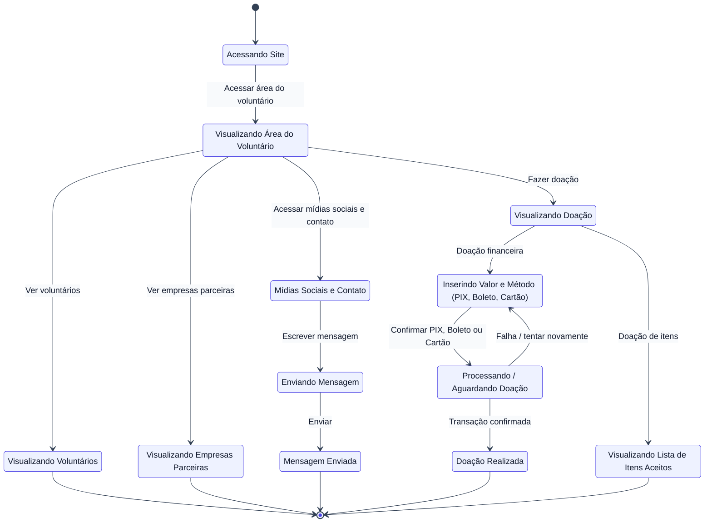

```mermaid
%%{init: {'theme': 'base', 'themeVariables': {'fontSize': '17px', 'fontFamily': 'arial', 'primaryColor': '#eef2ff', 'primaryBorderColor': '#4f46e5', 'primaryTextColor': '#0f172a', 'lineColor': '#334155', 'edgeLabelBackground': '#f8fafc'}, 'state': {'nodeSpacing': 75, 'rankSpacing': 70, 'padding': 16}, 'flowchart': {'nodeSpacing': 75, 'rankSpacing': 70}}}%%
stateDiagram-v2
    direction TB

    %% Estados Principais
    state "Acessando Site" as AcessandoSite
    state "Visualizando Área do Voluntário" as VisualizandoInformacoes

    %% 1. Consultas
    state "Visualizando Voluntários" as VisualizandoVoluntarios
    state "Visualizando Empresas Parceiras" as VisualizandoEmpresasParceiras

    %% 2. Contato e Mídias Sociais
    state "Mídias Sociais e Contato" as EntrandoEmContato
    state "Enviando Mensagem" as EnviandoMensagem
    state "Mensagem Enviada" as MensagemEnviada

    %% 3. Doação (integrado com o Caso de Uso do Voluntário)
    state "Visualizando Doação" as VisualizandoDoacao
    state "Inserindo Valor e Método (PIX, Boleto, Cartão)" as MetodoDoacao
    state "Processando / Aguardando Doação" as AguardandoDoacao
    state "Doação Realizada" as DoacaoRealizada
    state "Visualizando Lista de Itens Aceitos" as ListaItens

    %% Início
    [*] --> AcessandoSite
    AcessandoSite --> VisualizandoInformacoes : Acessar área do voluntário

    %% Ramificações a partir da Área do Voluntário
    VisualizandoInformacoes --> VisualizandoVoluntarios : Ver voluntários
    VisualizandoInformacoes --> EntrandoEmContato : Acessar mídias sociais e contato
    VisualizandoInformacoes --> VisualizandoDoacao : Fazer doação
    VisualizandoInformacoes --> VisualizandoEmpresasParceiras : Ver empresas parceiras

    %% Fluxo 1: Consultas Simples
    VisualizandoVoluntarios --> [*]
    VisualizandoEmpresasParceiras --> [*]

    %% Fluxo 2: Mídias Sociais e Contato
    EntrandoEmContato --> EnviandoMensagem : Escrever mensagem
    EnviandoMensagem --> MensagemEnviada : Enviar
    MensagemEnviada --> [*]

    %% Fluxo 3: Doações (Financeira ou Itens)
    VisualizandoDoacao --> MetodoDoacao : Doação financeira
    MetodoDoacao --> AguardandoDoacao : Confirmar PIX, Boleto ou Cartão
    AguardandoDoacao --> DoacaoRealizada : Transação confirmada
    AguardandoDoacao --> MetodoDoacao : Falha / tentar novamente
    VisualizandoDoacao --> ListaItens : Doação de itens
    DoacaoRealizada --> [*]
    ListaItens --> [*]
```
