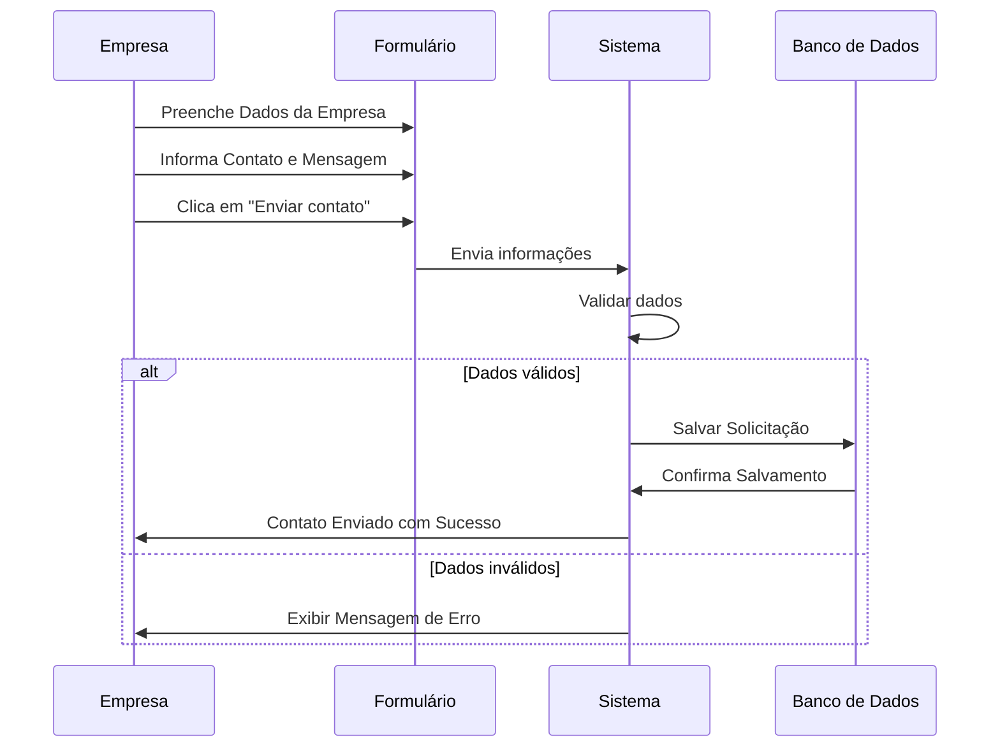

```mermaid
sequenceDiagram
    participant E as Empresa
    participant F as Formulário
    participant S as Sistema
    participant B as Banco de Dados

    E->>F: Preenche Dados da Empresa
    E->>F: Informa Contato e Mensagem
    E->>F: Clica em "Enviar contato"
    F->>S: Envia informações
    S->>S: Validar dados

    alt Dados válidos
        S->>B: Salvar Solicitação
        B->>S: Confirma Salvamento
        S->>E: Contato Enviado com Sucesso
        
    else Dados inválidos
        S ->> E: Exibir Mensagem de Erro
    end
```
