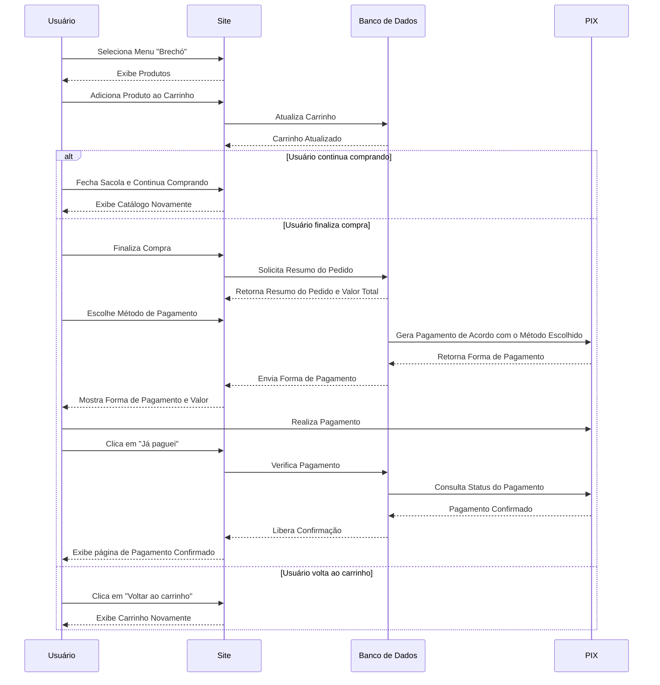

```mermaid
sequenceDiagram
    participant U as Usuário 
    participant S as Site
    participant B as Banco de Dados
    participant P as PIX

U->>S: Seleciona Menu "Brechó"
S-->>U: Exibe Produtos
U->>S: Adiciona Produto ao Carrinho
S->>B: Atualiza Carrinho
B-->>S: Carrinho Atualizado

alt Usuário continua comprando
U->>S: Fecha Sacola e Continua Comprando
S-->>U: Exibe Catálogo Novamente

else Usuário finaliza compra
U->>S: Finaliza Compra
S->>B: Solicita Resumo do Pedido
B-->>S: Retorna Resumo do Pedido e Valor Total
U->>S:Escolhe Método de Pagamento
B->>P: Gera Pagamento de Acordo com o Método Escolhido
P-->>B: Retorna Forma de Pagamento
B-->>S: Envia Forma de Pagamento
S-->>U: Mostra Forma de Pagamento e Valor
U->>P: Realiza Pagamento
U->>S: Clica em "Já paguei"
S->>B: Verifica Pagamento
B->>P: Consulta Status do Pagamento
P-->>B: Pagamento Confirmado
B-->>S: Libera Confirmação
S-->>U: Exibe página de Pagamento Confirmado

else Usuário volta ao carrinho
U->>S: Clica em "Voltar ao carrinho"
S-->>U: Exibe Carrinho Novamente
end

```
