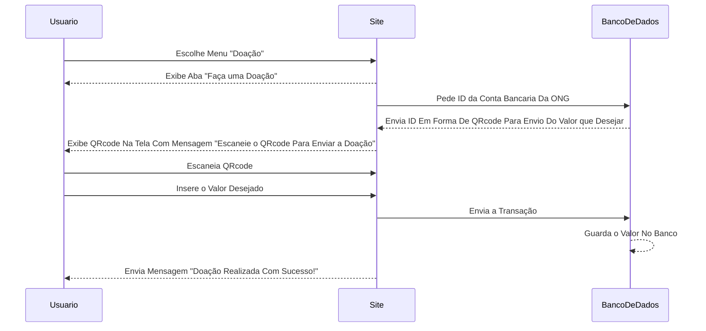

```mermaid
sequenceDiagram
participant U as Usuario
participant S as Site
participant B as BancoDeDados
U->>S:Escolhe Menu "Doação"
S-->>U:Exibe Aba "Faça uma Doação"
S->>B:Pede ID da Conta Bancaria Da ONG
B-->>S: Envia ID Em Forma De QRcode Para Envio Do Valor que Desejar
S-->>U:Exibe QRcode Na Tela Com Mensagem "Escaneie o QRcode Para Enviar a Doação"
U->>S:Escaneia QRcode
U->>S:Insere o Valor Desejado
S->>B: Envia a Transação
B-->>B:Guarda o Valor No Banco
S-->>U: Envia Mensagem "Doação Realizada Com Sucesso!"

```
